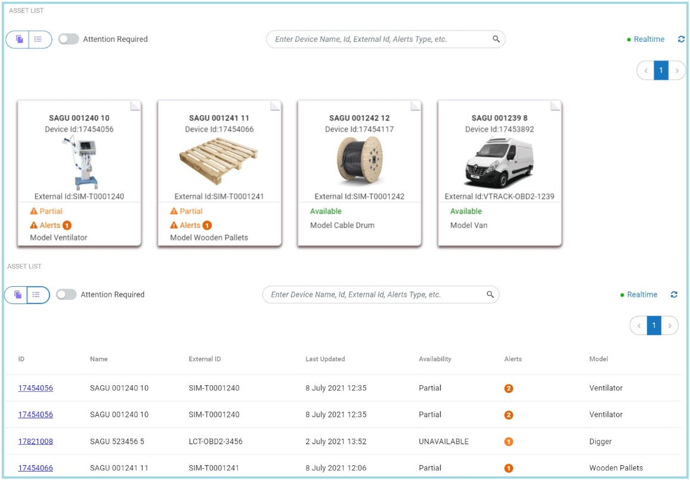

# Cumulocity Asset Viewer Widget Plugin 

The Asset Viewer Widget is the Cumulocity module federation plugin created using c8ycli. This plugin can be used in Application Builder or Cockpit.
The Cumulocity Asset Viewer Widget help you to display assets/devices data in Tile/Grid view, along with navigation to template dashboards. This widget plugin also supports various features such as display child devices/assets, configuration of fields/columns, search, display only assets/devices where attentions required, server side pagination, etc.

### Please choose Asset Viewer Widget release based on Cumulocity/Application builder version:

|APPLICATION BUILDER&nbsp; | &nbsp;CUMULOCITY&nbsp; |&nbsp; ASSET VIEWER WIDGET PLUGIN &nbsp; |
|--------------------|------------|-----------------------------|
| 2.0.x              | >= 1016.x.x | 1.x.x                       |

## Features
  
*  **Display Assets/Devices:** Displays Assets/Devices for give group in Tile/Grid mode. It also supports child devices/assets.

*  **Pagination:** Configurable Paginations and also option to set default page size.

*  **Configurable Columns:** User can choose what to display in each page of tiles from available list and also option to display custom field.

*  **Dashboard Settings (App Builder only):** Ability to navigate to dashboard by providing dashboard Id.

*  **Custom Images:**  Select and upload custom image to display in all tiles.  

*  **Attentions only:** Unique feature to display only assets/devices which are in high risk or have critical/major alerts. 

## Prerequisites:
   Cumulocity c8ycli >=1016.x.x
   

## Installation

### Runtime Widget Deployment?

* This widget support runtime deployment. Download [Runtime Binary](https://github.com/SoftwareAG/cumulocity-asset-viewer-widget-plugin/releases/download/1.0.7/sag-ps-pkg-asset-viewer-1.0.7.zip) and install via Administrations --> Ecosystems --> Applications --> Packages 

## QuickStart

This guide will teach you how to add widget in your existing or new dashboard.

1. Open your application from App Switcher

2. Add new dashboard or navigate to existing dashboard

3. Click `Add Widget`

4. Search for `Asset Viewer`

5. Select `Target Assets or Devices`

7. Click `Save`

Congratulations! Asset Viewer is configured.

## User Guide

 

*  **Target assets or devices:** User can select a device/asset or device/asset group. If group is selected, list of devices/assets will be display. If single device/asset selected and enable "Only Child Devices" options then all child devices/assets will be displayed. 
*  **Front Page Settings:** User can select up to 3 fields to display in front page of tile. If user selected "Other" as one of the field then one custom field can be configured for display.
*  **Page1 Settings:** User can select up to 5 fields to display in Page1  of tile. If user selected "Other" as one of the field then one custom field can be configured for display.
*  **Page2 Settings:** User can select up to 5 fields to display in Page2  of tile. If user selected "Other" as one of the field then one custom field can be configured for display.
*  **Dashboard Settings(Application Builder Only):** This feature is available only in application builder. User can navigate to any other dashboard by providing below details:
    * **Device Type:** Select a device type. Navigation will be applied to all devices/assets of this device/asset type to a specific dashboard.
    * **Dashboard ID:** Dashboard ID of a dashboard where user need to navigate. You can find dashboard id in browser URL.
    * **DeviceId as TabGroup:** Select this option only if you are using Group Template as dashboard in application builder and selected deviceId as tabgroup field during group template configuration.
    * **TabGroup ID(optional):** If your dashboard is based on tabgroup then provide tabgroup id.

* **Realtime:** Activate Realtime by default.
* **Include ExternalId:** Widget will call identity service for each asset/device to get external Id. Select only if needed. Not recommended for large set of devices.
* **Only Child Devices:** Display child devices/assets for selected device/assets.
* **Attentions Only(default):** Display only devices/assets where attentions required or have problems for example, critical/major alerts.
* **Grid View(default):** Display grid view instead of tile view by default.
* **Default Page Size:** Select records per page.
* **Upload Default Image:** Upload default image to display in all assets/devices. Please click on upload file after selecting image.

**Asset Viewer On Screen Options:**

*  **Toggle View Mode**: Switch between tile or grid view.
*  **Attention Required**: Activate this to display devices/assets where attentions is required.
*  **Search**: Smart Search filter. User can search by device/asset name, external id, device id, alert type, etc.
*  **Realtime** : On/Off Realtime option.
*  **Refresh**: Useful for force reload/refresh devices.
*  **Pagination**: Page navigation options.

------------------------------

This widget is provided as-is and without warranty or support. They do not constitute part of the Software AG product suite. Users are free to use, fork and modify them, subject to the license agreement. While Software AG welcomes contributions, we cannot guarantee to include every contribution in the master project.
_____________________
For more information you can Ask a Question in the [TECH Community Forums](https://tech.forums.softwareag.com/tag/Cumulocity-IoT).
